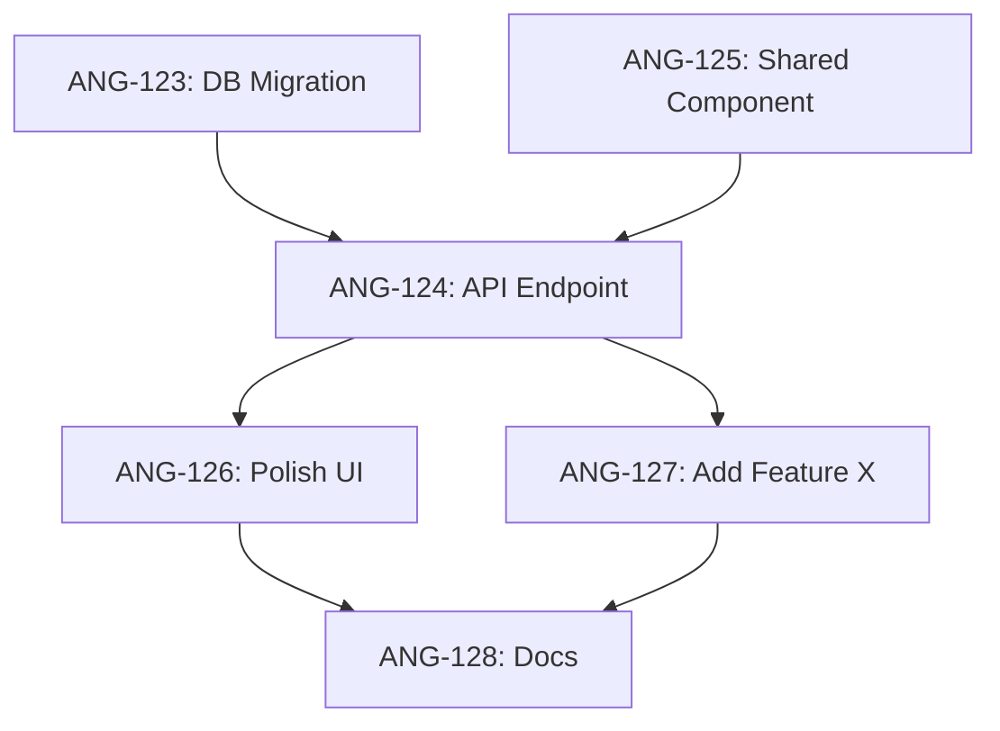

Generate a phased implementation plan from Linear project tickets, with dependency analysis, critical path identification, and risk assessment.

## Inputs
- Linear project ID or name (required)
- Team capacity (optional): e.g., "1 developer full-time" or "2 developers part-time"
- Timeline constraints (optional): e.g., "Must ship by March 1" or "4-week sprint"

## Process

### Step 1: Fetch Project Data
- Use `user-linear-get_project` to fetch project details
- Use `user-linear-list_issues` to fetch all project tickets
- Include: title, description, status, priority, labels, dependencies (blocks, blockedBy)

### Step 2: Analyze Dependencies
- Build dependency graph from blocks/blockedBy relationships
- Identify:
  - **Foundation tickets**: No dependencies (can start immediately)
  - **Dependent tickets**: Blocked by other tickets
  - **Critical path**: Longest chain of dependencies
  - **Parallel work**: Tickets with no shared dependencies

### Step 3: Group into Phases

Use this phasing strategy:

**Phase 0: Foundation**
- Database migrations
- API scaffolding  
- Shared components
- Infrastructure setup
- Tickets with no dependencies

**Phase 1: Core Features (MVP)**
- Critical path items
- Must-have user stories (high priority)
- Basic testing
- Tickets that unblock the most other work

**Phase 2: Enhancement**
- Nice-to-have features (medium priority)
- Polish and UX improvements
- Comprehensive testing
- Tickets with fewer dependencies

**Phase 3: Launch Prep**
- Documentation updates
- Security review
- Performance optimization
- Final testing
- Deployment planning

### Step 4: Estimate Phase Durations
- Sum effort estimates per phase
- Adjust for team capacity
- Add buffer for unknowns (20-30%)
- Calculate projected completion dates

### Step 5: Identify Risks
Flag high-risk tickets:
- **Complexity**: Tickets with "complex", "refactor", "migration" in title/labels
- **Unknowns**: Tickets with "spike", "research", "investigate"
- **Dependencies**: Tickets blocking many others (critical path)
- **External**: Tickets depending on third-party APIs or services

### Step 6: Suggest Parallel Work
Identify tickets that can be worked on simultaneously:
- No shared dependencies
- Different areas of codebase (backend vs frontend)
- Different developers can own them

## Output Format

### 1. Project Overview
```markdown
# Build Plan: [Project Name]

**Total Tickets**: X (Y epics, Z stories, N tasks)
**Estimated Duration**: N weeks (with M% buffer)
**Critical Path**: X tickets, Y weeks
**Parallel Work Opportunities**: Z ticket groups
**High-Risk Items**: N tickets flagged
```

### 2. Dependency Graph (Mermaid)


Show critical path in the description (don't use styling).

### 3. Phase Breakdown

For each phase, provide:

```markdown
## Phase 0: Foundation (Week 1)

**Goals:**
- Set up infrastructure
- Create shared components
- Prepare database

**Tickets:** (X total, Y weeks estimated)
- [ ] ANG-123 [Task] Database migration for email preferences (2d)
- [ ] ANG-124 [Task] Create shared preference component (1d)
- [ ] ANG-125 [Task] API scaffolding for preferences endpoint (1d)

**Dependencies:**
- None (can start immediately)

**Parallel Work:**
- ANG-123 and ANG-124 can be done simultaneously (different areas)

**Risks:**
- Database migration may require testing on staging first

**Testing Checkpoints:**
- [ ] Migration runs successfully on dev
- [ ] Shared component renders correctly
- [ ] API endpoint returns 200

---

## Phase 1: Core Features (Week 2-3)

[Repeat structure]
```

### 4. Critical Path Analysis
```markdown
## Critical Path (Longest Chain)

The critical path determines minimum project duration:

1. ANG-123: DB Migration (2d)
   ↓
2. ANG-124: API Endpoint (3d)
   ↓
3. ANG-126: Frontend Integration (4d)
   ↓
4. ANG-128: Testing (2d)

**Total Critical Path**: 11 days

**Bottleneck**: ANG-124 (blocks 5 other tickets)
```

### 5. Parallel Work Opportunities
```markdown
## Parallel Work Streams

These tickets can be worked on simultaneously:

**Stream A: Backend**
- ANG-123: DB Migration
- ANG-125: API Endpoint

**Stream B: Frontend**  
- ANG-124: Shared Component
- ANG-127: UI Updates

**Stream C: Documentation**
- ANG-129: Update docs
- ANG-130: Testing guide

**Recommendation**: Assign different developers to each stream to maximize velocity.
```

### 6. Risk Assessment
```markdown
## High-Risk Items

**Critical Path Risks** (blocks many tickets):
- ANG-124: API Endpoint (blocks 5 tickets)
  - Mitigation: Start early, add extra testing
  
**Complexity Risks** (technical unknowns):
- ANG-126: Email template rendering
  - Mitigation: Spike/prototype first, allocate extra time

**External Risks** (third-party dependencies):
- ANG-127: Brevo API integration
  - Mitigation: Have fallback plan, test early

**Scope Risks** (potential scope creep):
- ANG-128: "Advanced preferences"
  - Mitigation: Define clear acceptance criteria, defer enhancements to v2
```

### 7. Testing Strategy
```markdown
## Testing Checkpoints

**Phase 0 Exit Criteria:**
- [ ] All migrations run successfully
- [ ] Shared components render
- [ ] API endpoints return expected responses

**Phase 1 Exit Criteria:**
- [ ] Core user flows work end-to-end
- [ ] Unit tests pass
- [ ] Manual smoke test complete

**Phase 2 Exit Criteria:**
- [ ] All features tested
- [ ] Edge cases handled
- [ ] Performance acceptable

**Phase 3 Exit Criteria:**
- [ ] Security review complete
- [ ] Documentation updated
- [ ] Deployment plan reviewed
- [ ] Rollback plan tested
```

### 8. Store in Linear
Create a Linear Document:
- Title: "Build Plan: [Project Name]"
- Content: Full plan (markdown)
- Link to project

Return link to document.

## Rules

- **Prioritize by dependencies first**: Foundation before features
- **Flag high-risk tickets**: Complexity, unknowns, critical path
- **Suggest parallel work**: Maximize team velocity
- **Include testing checkpoints**: Quality gates per phase
- **Be realistic with estimates**: Add 20-30% buffer
- **Consider team capacity**: Adjust timeline based on availability
- **Identify bottlenecks**: Tickets blocking many others
- **Provide mitigation strategies**: For each risk identified
- **Use existing project structure**: Follow this project's patterns
- **Store in Linear**: Single source of truth

## Example Usage

```
User: /build-plan "Email Preferences"

Agent: Fetching project tickets from Linear...

Found 15 tickets across 2 epics:
- 5 foundation tasks
- 6 core feature stories
- 3 enhancement tasks
- 1 documentation task

Analyzing dependencies...
Critical path: 4 tickets, 11 days
Parallel work: 3 streams identified

Generating phased plan...

# Build Plan: Email Preferences

**Total Tickets**: 15
**Estimated Duration**: 3 weeks (with 25% buffer)
**Critical Path**: 4 tickets, 11 days
**High-Risk Items**: 2 tickets flagged

[Full plan follows...]

Build plan saved to Linear: [link]
Next: Run `/project-sync "Email Preferences"` to track progress.
```

## Integration with Other Commands

- After `/project-breakdown`: Use `/build-plan` to create implementation phases
- During development: Use `/project-sync` to track progress
- For status updates: Use `/project-status` for quick health check
- After completion: Use `/docs-update` to update documentation

## Advanced Features

### Capacity Planning
If team capacity is provided, adjust estimates:
- 1 full-time developer: Use estimates as-is
- 2 developers: Divide duration by ~1.5 (not 2, due to coordination overhead)
- Part-time: Multiply duration accordingly

### Timeline Constraints
If deadline is provided:
- Calculate if timeline is achievable
- Identify what can be cut to meet deadline
- Suggest scope reduction if needed
- Flag unrealistic expectations

### Velocity Tracking
If project has history:
- Calculate actual velocity (tickets/week)
- Adjust estimates based on historical data
- Provide confidence intervals

## Mermaid Diagram Guidelines

- Use ticket IDs as node names (no spaces)
- Keep labels concise
- Show critical path via description (don't use styling)
- Limit to ~15 nodes for readability
- Group related tickets in subgraphs if needed
